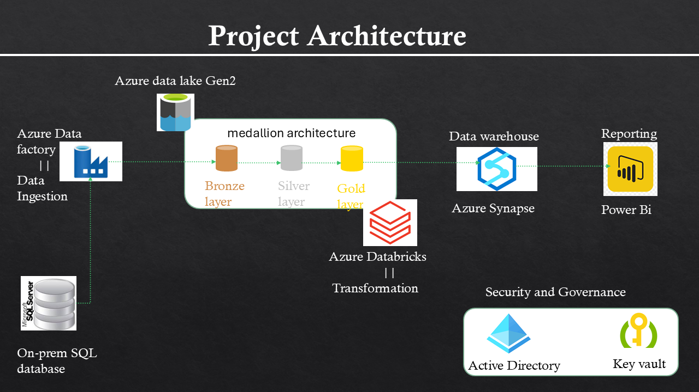
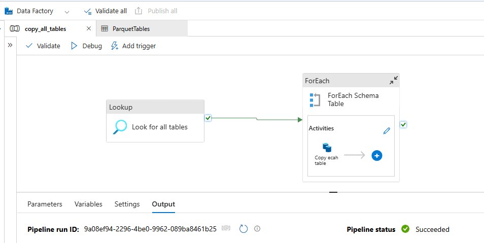

# Azure Data Engineering Project  
**End-to-End Data Pipeline Implementation Using Azure**

---

## **Project Overview**  
This project demonstrates an end-to-end data engineering solution built using Microsoft Azure. The pipeline automates data ingestion, transformation, storage, and visualization, providing an efficient and scalable system for managing enterprise data.  

### **Use Case**  
- **Data Ingestion:** Tables are ingested from an on-premise SQL Server database using Azure Data Factory and stored in Azure Data Lake.  
- **Data Transformation:** Raw data is cleaned and prepared using Azure Databricks.  
- **Data Storage:** Transformed data is loaded into Azure Synapse Analytics for querying and analysis.  
- **Data Visualization:** An interactive Power BI dashboard integrates with Synapse Analytics to deliver business insights.  
- **Governance & Monitoring:** Azure Key Vault and Microsoft Entra ID (formerly Azure AD) ensure security and compliance.

### **1. Project Architecture**


---

## **Key Features**  
- Automated data pipelines with Azure Data Factory.  
- Scalable data transformation using Azure Databricks.  
- Centralized data warehousing with Azure Synapse Analytics.  
- Dynamic, interactive dashboards in Microsoft Power BI.  
- Secure governance using Azure Key Vault and Microsoft Entra ID.  
- Comprehensive testing of the pipeline for end-to-end functionality.  

---

## **Technologies Used**  
- **Azure Data Factory**: Orchestrates data ingestion pipelines.  
- **Azure Data Lake**: Stores raw and intermediate data.  
- **Azure Databricks**: Processes and transforms raw data using PySpark.  
- **Azure Synapse Analytics**: Provides a data warehouse for reporting and analysis.  
- **Microsoft Power BI**: Visualizes insights with dynamic dashboards.  
- **Azure Key Vault**: Secures sensitive credentials.  
- **Microsoft Entra ID**: Provides identity management and governance.  

---

## **Pipeline Architecture**  
### **Steps**  
1. **Data Ingestion**:  
   - Ingest raw tables from SQL Server using Azure Data Factory (ADF).  
	[Self-Hosted-Integration-Service running On-prem](screenshots/1.self_hosted_integration_runtime_manager.png)  
	[On-prem SQL Server database: AdventureWorks2017](screenshots/2.On_prem_SQL_Server_AdventureWorks2017.png)

   - Store the raw data in Azure Data Lake.  
	[Azure Data Lake Storage container](screenshots/3.Azure_Datalake_storage_gen2.png)

 ** Pipeline which copy all tables Bronze container**

      
2. **Data Transformation**:  
   - Use Azure Databricks to clean and standardize the data.  
	a. Adjusting date columns to a standard "yyyy-MM-dd" format.  
	b. Saving the transformed tables to their respective directories in the "silver" layer.  
  	[Transforming date columns script](notebooks/bronze_to_silver.py)  

	c. Renaming column names to follow the `snake_case` naming convention.  
	d. Saving the transformed tables in Delta format in the "gold" layer.    
	[snake_case naming columns script](notebooks/silver_to_gold.py)  

3. **Data Loading**:  
   - Load the transformed data into Azure Synapse Analytics.  
   - Perform additional SQL transformations if needed.  

4. **Data Visualization**:  
   - Connect Power BI to Synapse Analytics for reporting.  
   - Create dynamic dashboards to visualize KPIs and trends.  

5. **Monitoring and Governance**:  
   - Use Azure Key Vault to securely store credentials.  
   - Monitor pipelines using Azure’s in-built monitoring tools and Python scripts.

---

## **How to Use**  

### **1. Prerequisites**  
- Active Azure Subscription.  
- Power BI Desktop installed locally.  
- Python environment for running Databricks and Key Vault scripts.  

### **2. Steps to Set Up**  
1. Clone this repository:  
   ```bash
   git clone https://github.com/frankadane/azure-data-engineering-pipeline.git
